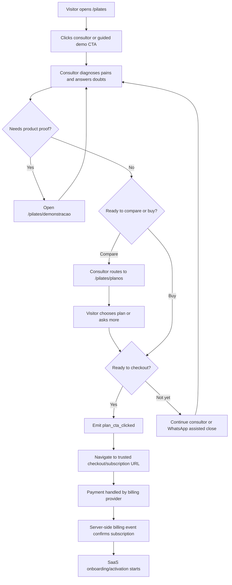

# Pricing & Subscription Flow: Pilates Landing

## Purpose

This artifact defines what the landing owns for pricing and subscription conversion. It does not implement billing. Billing activation, webhooks, entitlements, failed payments, invoices and customer portal belong to a separate billing feature spec.

## Launch Plans

Public plans are organized by number of active AI agents.

| Plan ID | Public Name | Monthly Price | Recommended | Best For |
| --- | --- | ---: | --- | --- |
| `base` | Base | R$ 197/mes | No | Studios that want CRM without active AI agents yet. |
| `one_agent` | 1 Agente | R$ 497/mes | No | Studios that want to automate one clear operational pain first. |
| `three_agents` | 3 Agentes | R$ 897/mes | No | Studios that want meaningful automation across a few priority routines. |
| `seven_agents` | 7 Agentes | R$ 1.497/mes | Yes | Studios that want the complete system with all seven operational agents. |

Annual billing can be shown only when annual price/discount is configured. Suggested launch framing is two months free equivalent, but it must not appear publicly until a checkout provider supports it.

## Plan Card Requirements

Each plan card must display:

- plan name
- monthly BRL price
- best-fit studio profile
- included agent coverage
- WhatsApp availability
- setup/onboarding expectation
- usage boundary/hard cap
- consultor CTA as the main landing action
- secondary checkout CTA only on the dedicated plans/decision page
- secondary WhatsApp/human-assistance CTA when configured

The 7 Agentes card is visually recommended as the complete-system plan. The other plans remain valid purchase paths for narrower needs or price-fit.

## Launch Entitlements

The landing must present plan differences from the same trusted configuration used by billing and onboarding.

| Plan ID | Public Included Scope | Usage Boundary | Onboarding/Support | Custom Agent |
| --- | --- | --- | --- | --- |
| `base` | 0 active AI agents; CRM only | 1 studio, 1 user, no automated WhatsApp agent, 0 AI messages/month | Self-guided setup with AI and 24/7 AI support | Separate business |
| `one_agent` | 1 selected primary agent | 1 studio, 2 users, studio-owned WhatsApp, 1,500 AI messages/month hard cap | Self-guided setup with AI and 24/7 AI support | Separate business |
| `three_agents` | 3 selected primary agents | 1 studio, 5 users, studio-owned WhatsApp, 5,000 AI messages/month hard cap | Self-guided setup with AI and 24/7 AI support | Separate business |
| `seven_agents` | All seven primary agents: Atendimento, Agenda, Vendas, Financeiro, Retencao, Gestao and Historico/Evolucao | 1 studio, 10 users, studio-owned WhatsApp, 15,000 AI messages/month hard cap | Self-guided setup with AI and 24/7 AI support | Separate business |

Public copy may use friendlier wording such as "limite de uso do plano", but it must not claim unlimited use. When the customer reaches the configured cap, additional automated AI usage requires upgrade or extra quota purchase.

## Subscription Flow

## Hard Boundaries

- The landing never collects card data, payment credentials or billing documents.
- The chat widget and assisted-conversion form never collect payment data.
- A plan CTA click is a subscription intent, not an active subscription.
- The main landing should not send cold visitors directly to checkout as its primary action.
- The consultor is the default bridge from interest to plans/checkout.
- Active subscription can only come from trusted server-side billing confirmation.
- Checkout URLs must come from trusted niche configuration.
- User input, query strings and AI output must never generate checkout URLs.

## Tracking Payloads

`plan_cta_clicked` must include:

- `planId`
- `planName`
- `billingPeriod`
- `priceBRL`
- `sourceSection`
- `niche`
- `campaignStage`
- `publicOfferMode`

`human_whatsapp_clicked` from a plan card should include the selected/interested plan when available.

`plan_consultor_clicked` must include:

- `planId`
- `planName`
- `billingPeriod`
- `sourceSection`
- `niche`
- `campaignStage`
- `publicOfferMode`
- `consultorContext`

## Open Billing Spec Items

Create a focused billing spec before implementing active subscriptions:

- payment provider and account setup
- checkout session creation or trusted checkout link strategy
- customer and tenant mapping
- webhook signature verification and idempotency
- subscription status model
- entitlement enforcement
- failed payment and cancellation handling
- upgrade, downgrade and proration behavior
- invoice/tax/coupon requirements
- customer portal
