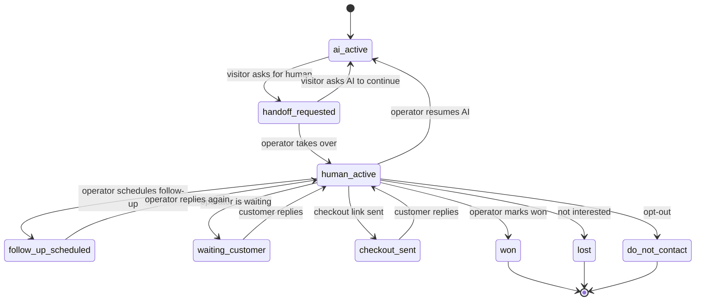

# Human WhatsApp Handoff: Floating AI Attendant

## Purpose

Define exactly what happens when the visitor asks to talk to a human before subscribing.

WhatsApp human handoff is an assisted-close path. It is not the primary purchase path and it is not a separate AI brain.

Production WhatsApp channel readiness, provider status handling, template gates and E2E launch blockers are defined in [whatsapp-e2e-readiness.md](./whatsapp-e2e-readiness.md).

## Takeover Surface Decision

Because WhatsApp v1 uses the official Meta WhatsApp Cloud API, human takeover requires Sales Inbox or an approved shared inbox. Sales Inbox/Postgres is the lead source of truth and real-time reply surface for v1.

V1 must provide one operator-controlled reply surface for WhatsApp handoffs and all commercial lead control. The default implementation is the internal Sales Inbox, which sends replies through the same server-side WhatsApp provider adapter used by the AI attendant.

The console may be replaced later by a shared inbox/BSP if that provider is selected, but the v1 product behavior remains the same:

- operator can see all SaaS sales leads from widget and WhatsApp;
- operator can open safe context, recent conversation turns, interested plan and next action;
- operator can pause automated AI replies for that WhatsApp contact/session;
- operator can send a human reply through the configured WhatsApp provider;
- operator can send configured plan-page and checkout links;
- operator can mark the conversation as waiting customer, checkout sent, won, lost, needs follow-up, do-not-contact or resume AI;
- Sales Inbox/Postgres stores the commercial record after those state changes.

Optional external mirrors can show lead alerts or digest data, but human takeover must be operated through Sales Inbox or an approved shared inbox.

## Trigger

The handoff starts when the visitor says or clicks something like:

- "quero falar com uma pessoa"
- "me chama no WhatsApp"
- "prefiro conversar antes de assinar"
- "tenho duvidas e quero atendimento humano"
- plan card secondary CTA: "Falar com humano"

## Required Flow

1. Agent confirms the visitor wants human assistance before subscribing.
2. Agent checks whether it already has a safe WhatsApp/contact.
3. If contact is missing in web chat, agent asks for WhatsApp or email/cellphone.
4. Agent creates a concise assisted-closing summary.
5. Agent creates or updates a handoff session with status `requested`.
6. Agent opens/routes to the trusted human WhatsApp assistance destination when the request started on web.
7. Agent emits `floating_agent_human_whatsapp_handoff`.
8. Server stores the lead in Sales Inbox/Postgres and may send an optional n8n high-intent/handoff alert.
9. Operator opens the internal Sales Inbox, reviews context and clicks/takes `human_active`.
10. Automated AI follow-up pauses for that WhatsApp contact/session while `human_active`.
11. Operator sends human replies through the server-side WhatsApp provider adapter.
12. Operator closes, schedules follow-up, marks won/lost or resumes AI.

If the operator or n8n needs to follow up after the active WhatsApp service window, the message must use an approved Meta template from `whatsapp-template-copy.md`. If no approved template exists, the system records the blocked follow-up and keeps the lead visible in the Sales Inbox instead of sending an unapproved proactive message.

## Handoff Summary

The summary must include:

- conversion path: `human_whatsapp_assist`
- channel where the request started
- selected/interested plan when available
- selected pains
- recommended agents
- qualification fields already captured
- short conversation summary
- missing important fields
- opt-in/consent status when available

The summary must not include:

- card/payment data
- sensitive student health details
- full raw transcript by default
- prompt, guardrail or internal policy text

## AI Pause Rules

When handoff is active:

- On web, the chat may still answer general product questions, but should not pretend to be the human closer.
- On WhatsApp, automated replies stop after the operator marks the session as `human_active`.
- If the visitor explicitly asks the AI to continue before the human responds, the agent may answer product questions but must keep the handoff status visible in metadata.
- If the operator marks `resume_ai`, the next inbound WhatsApp message can be handled by the AI again using the same approved answer policy.
- If the operator marks `won`, `lost` or `do_not_contact`, automated replies must not restart without an explicit new inbound opt-in/intent.
- Unsupported WhatsApp media during takeover is stored as safe metadata when possible and routed to the operator; the AI must not claim it interpreted the media.

## Handoff State Machine

## Internal Sales Inbox Requirements

Minimum v1 inbox:

- protected internal route or authenticated operator surface;
- list sales leads by status, priority, channel, conversion path, last message, next action and interested plan;
- show safe lead summary, selected pains, recommended agents, contact, source page, custom-agent request when applicable and recent messages;
- show recent messages with sensitive-data redaction where possible;
- buttons/actions: `take_over`, `send_whatsapp_message`, `send_plan_page`, `send_checkout_link`, `schedule_follow_up`, `resume_ai`, `mark_waiting_customer`, `mark_won`, `mark_lost`, `mark_do_not_contact`, `edit_lead_summary`;
- every action emits a server-side audit/tracking event;
- sending messages uses the server-side WhatsApp adapter, never browser-side provider credentials;
- sending plan-page or checkout links uses trusted configuration only;
- `checkout_sent` does not mean paid or subscribed;
- web and WhatsApp activity must merge only on strong identifiers such as WhatsApp, email, `leadId` or `sessionId`;
- operator messages must include tenant/project/operator context in logs without exposing secrets.

## Trusted Destinations

The human WhatsApp destination must come from system configuration.

The model must not generate arbitrary WhatsApp links or phone numbers.

## n8n Responsibilities

n8n may:

- create/update the opportunity record;
- notify the human closer;
- attach the safe summary;
- tag the opportunity as `human_whatsapp_assist`;
- create a follow-up task.
- store operator state changes in Sales Inbox/Postgres and optionally notify n8n.

n8n must not:

- be the real-time chat brain;
- verify WhatsApp provider webhooks;
- bypass opt-out/consent state;
- mark the visitor as subscribed.

## Acceptance Criteria

- Visitor can request a human from web chat or WhatsApp.
- Handoff includes safe summary and selected/interested plan when available.
- Human WhatsApp destination is trusted configuration.
- AI does not continue aggressive selling after handoff.
- AI pauses on WhatsApp after operator takeover and resumes only through explicit operator action or new allowed inbound context.
- Operator can send a human WhatsApp reply through a protected server-side surface.
- Out-of-window human or automated follow-up is blocked unless an approved Meta template is available and the lead is eligible.
- n8n failure does not block showing the human handoff CTA.
