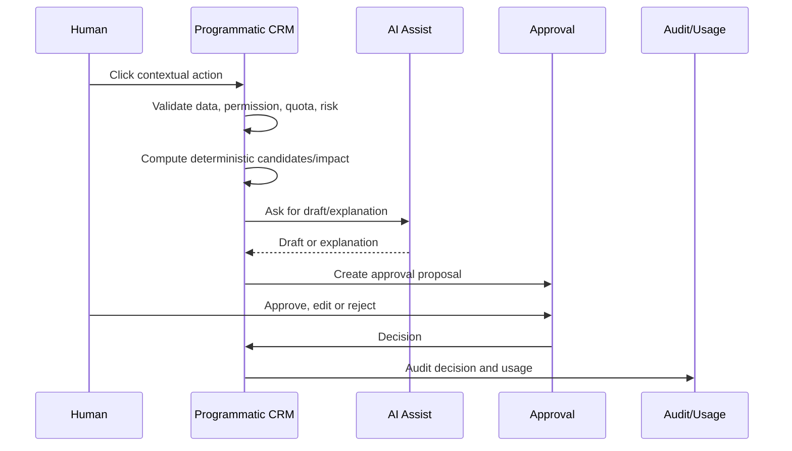
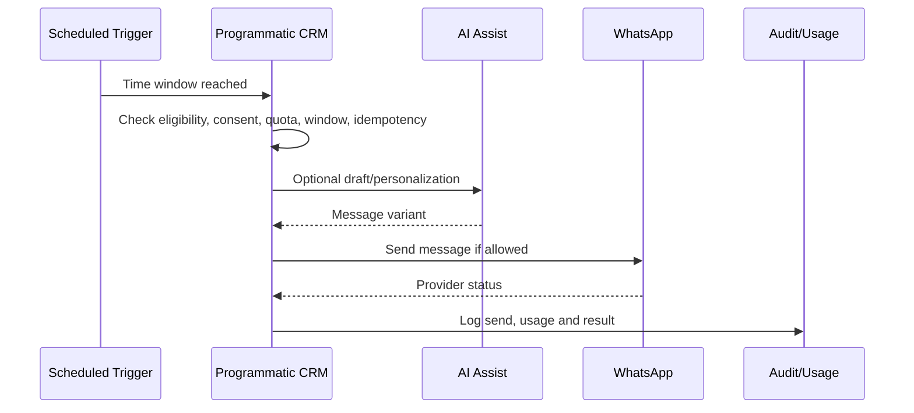
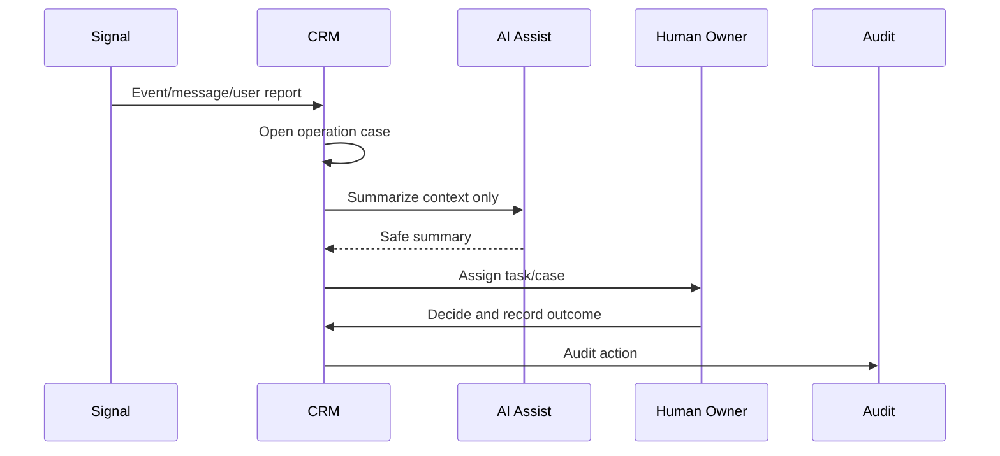
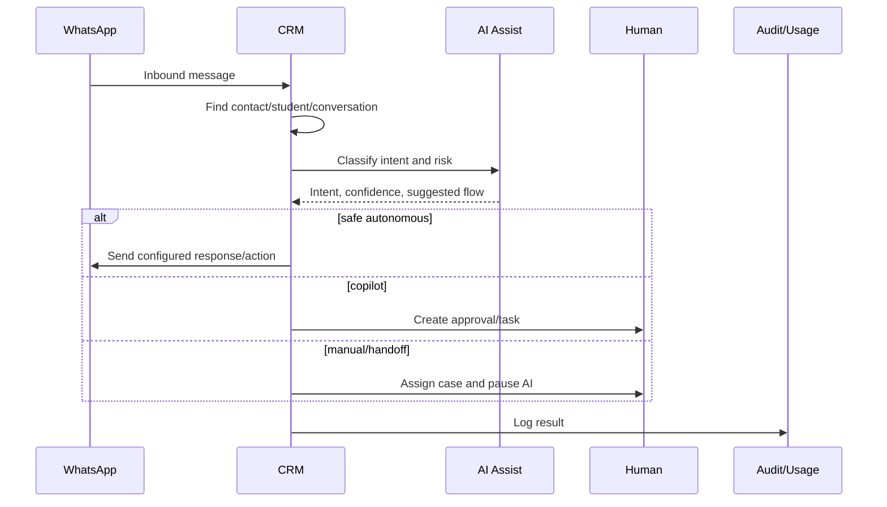
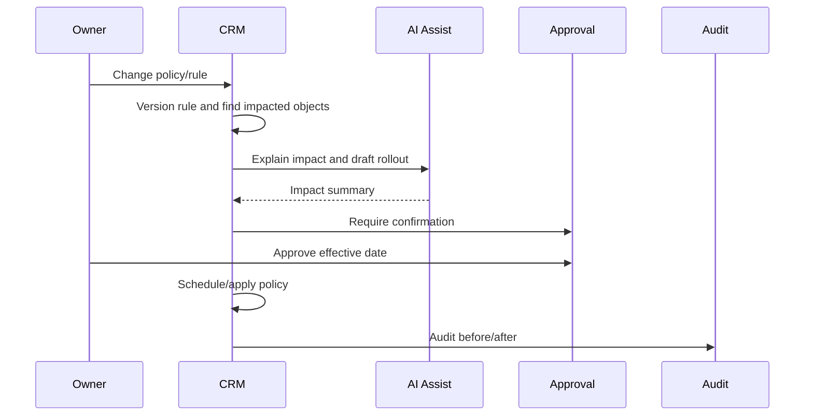
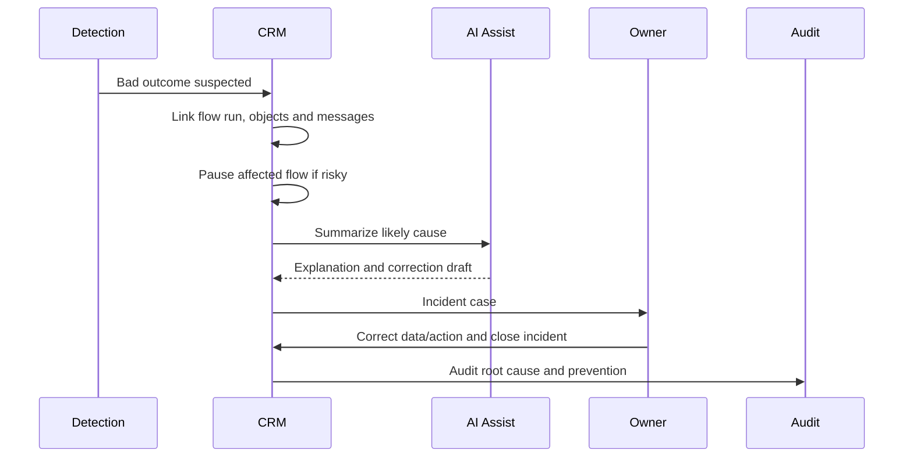

# Execution Swimlanes - Human, System, AI, WhatsApp And Audit

> Status: exploratory. These blueprints show how representative use cases should execute across manual, copilot and autonomous paths.

## Pattern A - Contextual Button With Copilot

Use for:

- MUC-062 Recover open slot;
- MUC-073 Send Pix/payment link;
- MUC-094 Recover trust;
- MUC-118 Change policy.

## Pattern B - Autonomous Low-Risk Reminder

Use for:

- MUC-042 Trial reminder;
- MUC-057 Presence confirmation;
- MUC-071 Due reminder;
- MUC-092 Satisfaction check.

## Pattern C - Manual-First Sensitive Case

Use for:

- MUC-079 Financial exception;
- MUC-089 Cancellation risk;
- MUC-097 Sensitive health/personal event;
- AUD-013 Refund/dispute.

## Pattern D - Inbound WhatsApp To CRM Flow

Use for:

- MUC-024 New WhatsApp conversation;
- MUC-025 Existing student request;
- MUC-040 Price/plan question;
- MUC-060 Make-up request.

## Pattern E - Policy Change

Use for:

- MUC-013 Operational policies;
- MUC-118 Change operational rule/policy;
- AUD-001 Holidays/recess;
- AUD-009 Holiday/recess class impact.

## Pattern F - Automation Incident

Use for:

- MUC-117 Investigate automation incident;
- F14;
- bad data after a successful run.

## Design Rule

Every use case should use one of these patterns or explicitly justify a new pattern.
