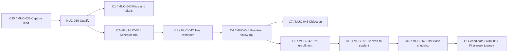
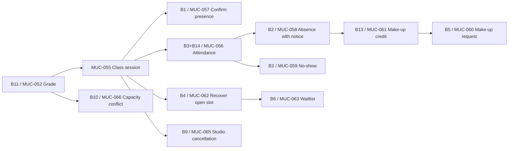
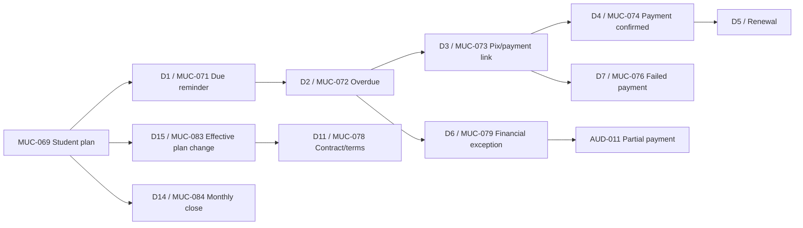
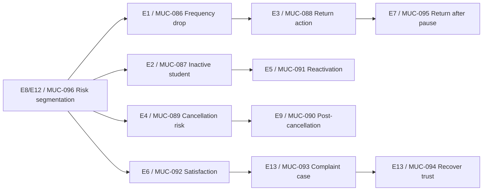
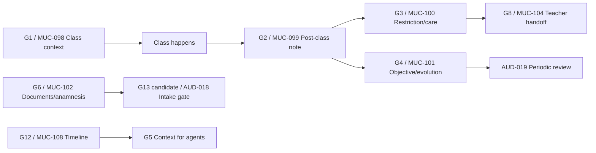
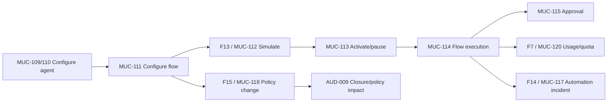
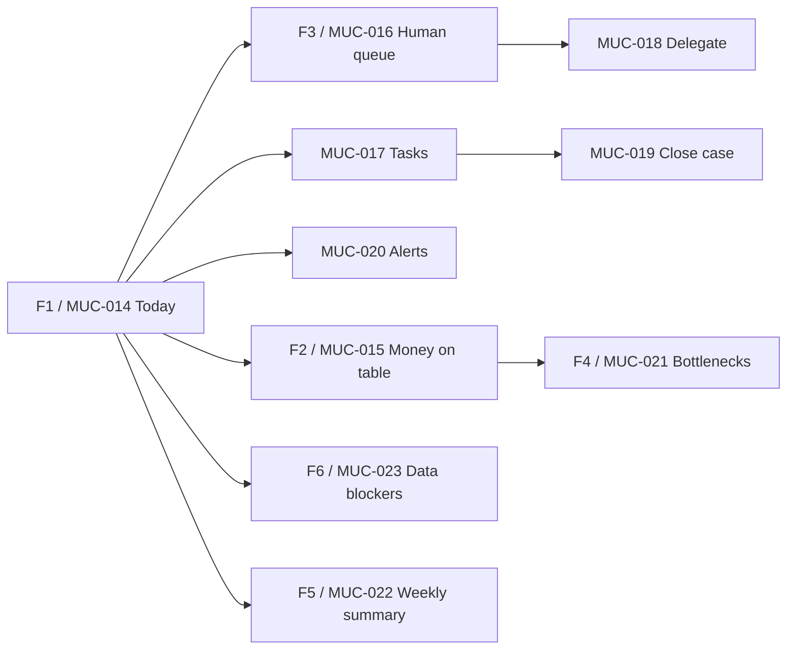

# Journey Metro Map - Taliya CRM

> Status: exploratory visual map. This document turns the master use cases into journey lines. It does not finalize scope.

## How To Read

- Lines = business journeys.
- Stations = use cases/screens.
- Transfers = handoff between modules/agents.
- Gates = approval, quota, permission, data quality or risk checks.

## Line 1 - Lead To Student

## Line 2 - Agenda Operation

## Line 3 - Student Finance

## Line 4 - Retention And Trust

## Line 5 - Student History And Teacher Work

## Line 6 - Agent Runtime And Governance

## Line 7 - Daily Manager Loop

## Cross-Line Transfers

| From | To | Examples |
| --- | --- | --- |
| Sales | Agenda | Trial scheduling, no available slot, first class. |
| Agenda | Retention | No-show, frequency drop, many make-up credits. |
| Finance | Retention | Payment risk, pause, cancellation, dispute. |
| Inbox | Any module | WhatsApp message routes to owner flow. |
| History | Retention | Sensitive event or restriction affects churn risk. |
| Agent Runtime | Operations | Approval, incident, blocked data or quota limit. |
