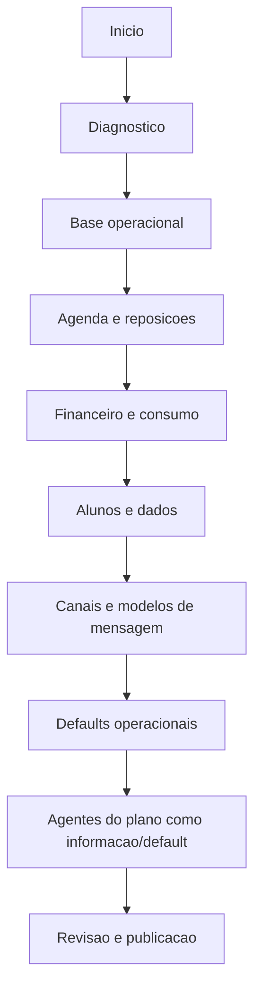
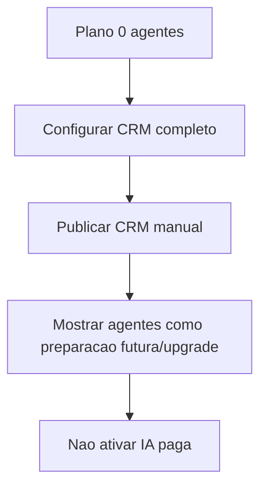
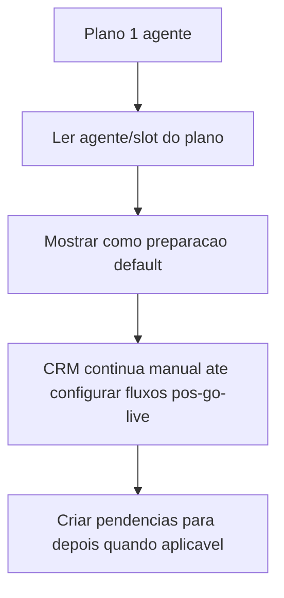

# Arvore Adaptativa Do Setup

Status: rascunho consolidado.
Data: 2026-05-13.

## Objetivo

Definir como o setup muda de caminho conforme respostas anteriores, sem virar um labirinto para o gestor.

## Regra central

O setup e adaptativo, mas nao livre.

O agente guia a conversa. O sistema decide os proximos blocos a partir de estado estruturado.

## Estado global usado pela arvore

```text
SetupState
  supportCallRequested
  tenantPlan
  activeAgentSlots
  hasMultipleUnits
  hasImportedData
  agendaModel
  billingModel
  usesLessonCredits
  usesReplacement
  hasWhatsApp
  hasFinanceRules
  hasPublishedPolicies
  quotaStatus
  unresolvedConflicts
  publishableLayers
```

## Fluxo base



## Desvios principais

### Plano 0 agentes



Resultado:

- pular ativacao de agentes;
- nao mostrar configuracao de fluxos;
- publicar CRM, agenda, financeiro, tarefas e aprovacoes.

### Plano com 1 agente



Resultado:

- nao perguntar se o plano tem agente;
- nao pedir escolha livre de agente no setup;
- demais areas nao devem parecer quebradas;
- mostrar caminho manual antes de upgrade.

### Plano com 3 agentes

Resultado:

- ler agentes incluidos/trocados do plano;
- areas sem agente continuam manuais;
- cota/economia aparece depois, nao como configuracao inicial;
- fluxos sensiveis ficam como rascunho/pendencia para Agentes/Fluxos pos-go-live.

### Plano com 7 agentes

Resultado:

- ler todos os dominios/agentes do plano;
- manter regras de seguranca, aprovacoes e excecoes como default conservador;
- marcar fluxos que exigem configuracao profunda;
- uso/cotas e incidentes aparecem como destinos de control plane pos-go-live, nao como configuracao profunda do onboarding.

## Desvios por agenda

| Condicao | Caminho |
|---|---|
| Studio nao usa reposicao | Pular regras de credito de reposicao, mas manter falta/no-show. |
| Studio usa reposicao | Perguntar prazo, elegibilidade, consumo, encaixe e bloqueio financeiro. |
| Studio usa aulas avulsas | Priorizar disponibilidade, pagamento por evento e consumo unico. |
| Studio nao tem salas/recursos | Pular recursos; capacidade fica por turma. |
| Studio tem conflito de sala/professor | Criar pendencia de Agenda e impedir que qualquer automacao futura seja preparada como pronta. |

## Desvios por financeiro

| Condicao | Caminho |
|---|---|
| Mensalidade simples | Pular banco de creditos; configurar vencimento, tolerancia e reposicao simples. |
| Pacote/creditos | Perguntar validade, consumo, devolucao, expiracao e saldo inicial. |
| Modelo hibrido | Recomendar chamada humana; publicar CRM manual e manter financeiro em revisao. |
| Sem financeiro no setup | CRM/agenda podem publicar, mas financeiro e automacao de reposicao sensivel ficam manuais. |
| Inadimplencia afeta agenda | Exigir regra de seguranca clara e previa de impacto. |

## Desvios por canais

| Condicao | Caminho |
|---|---|
| WhatsApp conectado | Pode configurar modelos de mensagem e envio manual; automacao externa fica para Agentes/Fluxos. |
| WhatsApp nao conectado | Bloquear envio externo autonomo; manter tarefas e mensagens manuais. |
| Opt-out indefinido | Usar default restritivo. |
| Modelo de mensagem nao aprovado | Permitir rascunho manual; bloquear automacao externa. |

## Desvios por regras de seguranca e automacao futura

| Condicao | Caminho |
|---|---|
| Regra de seguranca nao publicada | Autonomia fica como pendencia para depois; CRM manual e ajuda segura podem seguir quando permitido. |
| Cota 70% | Publicar com alerta. |
| Cota 90% | Economia ativa; baixa prioridade vira tarefa/aprovacao. |
| Cota 100% | Automacao paga bloqueada; caminho manual. |
| Fallback inexistente | Fluxo fica pendente para Agentes/Fluxos. |
| Simulacao necessaria | Nao ocorre no setup inicial; cria pendencia de simulacao pos-go-live. |

## Publicacao adaptativa

O setup pode encerrar com:

- CRM manual publicado;
- agenda publicada, financeiro pendente;
- financeiro publicado, canais pendentes;
- agentes preparados com rascunhos/pendencias;
- autonomia deixada para Agentes/Fluxos por seguranca;
- publicacao completa.

## Aceite

Esta arvore esta correta quando:

- nenhuma resposta leva a beco sem saida;
- todo bloqueio tem caminho manual;
- 0 agentes chega ao CRM funcional;
- autonomia aparece apenas como destino futuro quando for necessario explicar uma pendencia;
- chamada humana nunca cria uma arvore paralela.
