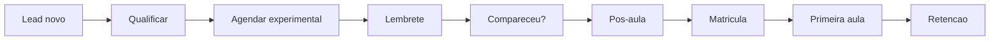
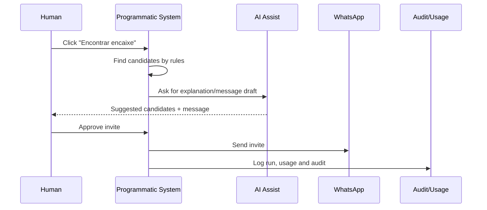
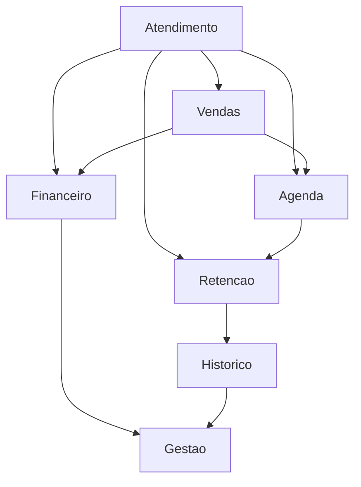
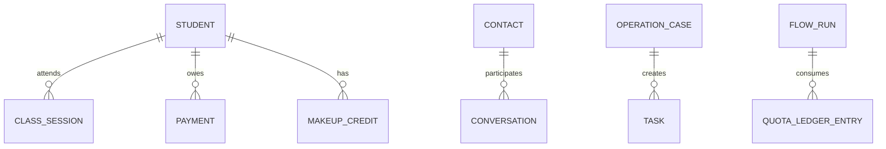
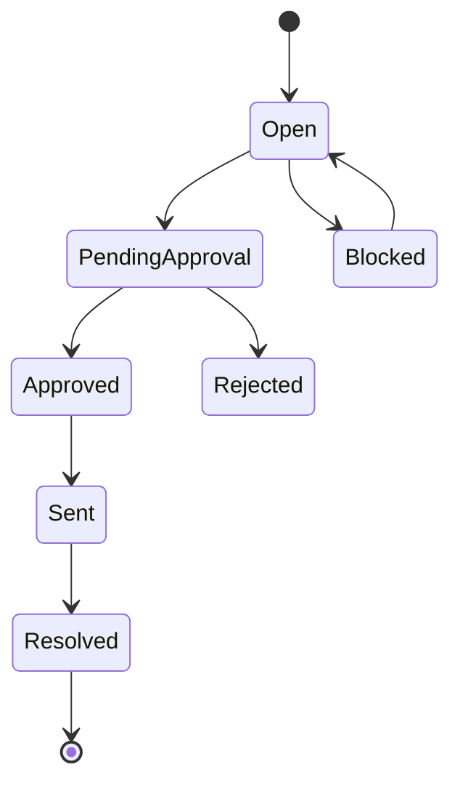

# Visual Mapping Toolkit - Taliya CRM, Agents And Use Cases

> Status: exploratory draft. This document lists many complementary ways to visualize Taliya's CRM web, mobile app, AI-agent flows, manager use cases, modes and screens. The goal is to reduce confusion while the product is still being mapped.

## Why We Need Multiple Views

No single diagram can explain the whole product.

Taliya has several overlapping layers:

- CRM web;
- mobile app;
- WhatsApp;
- manager journeys;
- student/interested-person journeys;
- 96 candidate agent flows;
- 157 candidate manager use cases;
- manual, copilot and autonomous execution modes;
- programmatic work versus AI work;
- routes, pages, drawers, buttons and automations;
- approvals, quotas, audit, incidents and policies.

Therefore, we need multiple visual lenses.

## Recommended Core Set

If we only pick a few, use these:

1. **Master Table**: source of truth.
2. **Journey Metro Map**: end-to-end paths.
3. **Object Action Map**: screens/buttons by business object.
4. **Swimlane Execution Blueprint**: human vs system vs AI vs WhatsApp.
5. **Screen Inventory Tree**: web/app route structure.
6. **Decision Kanban**: candidate, accepted, merged, deferred, out.
7. **Heatmap**: coverage and gaps.

## 1. Master Product Table

Question answered:

```text
What exists, what is accepted, and where does it live?
```

Format:

| ID | Type | Area | Case/Flow | Object | Route | Web | Mobile | WhatsApp | Manual | Copilot | Auto | Status |
| --- | --- | --- | --- | --- | --- | --- | --- | --- | --- | --- | --- | --- |
| MUC-062 | Use case | Agenda | Recover open slot | ClassSession | `/app/aulas/[id]` | yes | partial | possible | yes | yes | yes | candidate |

Best for:

- filtering;
- counting;
- status tracking;
- linking use cases to screens.

## 2. Journey Metro Map

Question answered:

```text
How does a real operation flow from start to finish?
```

Example:



Best for:

- sales journey;
- agenda journey;
- cancellation journey;
- overdue payment journey.

## 3. City Map

Question answered:

```text
What are the big product neighborhoods?
```

Metaphor:

- neighborhoods = modules;
- streets = journeys;
- buildings = screens;
- vehicles = agents;
- traffic lights = approvals/gates;
- tolls = quotas;
- police report = audit/incident.

Example areas:

- Inbox District;
- Agenda District;
- Finance District;
- Student History District;
- Agent Control Center;
- Data Quality Yard.

Best for:

- explaining product to non-technical stakeholders;
- avoiding route-list fatigue.

## 4. Object Action Map

Question answered:

```text
Given an object, what can the user or agent do?
```

Example:

```text
ClassSession
  - open class
  - take attendance
  - confirm presence
  - register absence
  - create make-up credit
  - find fit for open slot
  - cancel class
  - notify affected students
  - show teacher context
  - audit correction
```

Best for:

- discovering buttons;
- deciding pages vs drawers;
- deciding mobile actions.

## 5. Swimlane Execution Blueprint

Question answered:

```text
Who does what: human, system, AI, WhatsApp, audit?
```

Example:



Best for:

- separating deterministic logic from AI;
- designing manual/copilot/autonomous modes;
- reducing unsafe autonomy.

## 6. Screen Inventory Tree

Question answered:

```text
Which pages, subpages, drawers and mobile screens exist?
```

Example:

```text
/app
  /hoje
  /inbox
    /conversas/[id]
  /agenda
    /aulas/[id]
      drawer: encontrar encaixe
      drawer: cancelar aula
      modal: corrigir chamada
  /financeiro
    /pagamentos/[id]
      drawer: preparar cobranca
```

Best for:

- route planning;
- frontend architecture;
- avoiding unnecessary pages.

## 7. Decision Kanban

Question answered:

```text
What is decided, unresolved, merged or out?
```

Columns:

- Candidate;
- Needs detail;
- Accepted;
- Merge into existing;
- Web only;
- Mobile needed;
- Button/drawer only;
- Out of scope;
- Deferred after launch.

Best for:

- product workshops;
- keeping uncertainty visible.

## 8. Coverage Heatmap

Question answered:

```text
Where are the gaps?
```

Axes:

- rows = product areas;
- columns = manual, copilot, autonomous, web, mobile, WhatsApp, audit, quota, permission.

Color:

- green = mapped;
- yellow = partial;
- red = missing;
- gray = intentionally not needed.

Best for:

- audit reviews;
- spotting weak modules.

## 9. Mode Radar

Question answered:

```text
How autonomous should this be?
```

Zones:

- center = manual only;
- middle = copilot;
- outer = autonomous eligible;
- outside = not allowed.

Examples:

- refund: manual only;
- cancellation message: copilot;
- presence reminder: autonomous eligible;
- health advice: not allowed.

Best for:

- autonomy boundaries;
- risk discussions.

## 10. Agent Responsibility Map

Question answered:

```text
Which agent owns which flows and where do they hand off?
```

Example:



Best for:

- agent architecture;
- transition validation.

## 11. Use Case Card Deck

Question answered:

```text
Can we decide each case individually?
```

Card fields:

- ID;
- name;
- actor;
- object;
- trigger;
- primary route;
- manual path;
- copilot path;
- autonomous path;
- risk;
- output;
- decision status.

Best for:

- workshops;
- sorting and grouping;
- scope decisions.

## 12. Button Map

Question answered:

```text
What smart actions appear on each screen?
```

Example:

| Screen | Button | Object | Agent | Mode |
| --- | --- | --- | --- | --- |
| Class detail | Encontrar encaixe | ClassSession | Agenda | manual/copilot/auto |
| Payment detail | Preparar cobranca | Payment | Financeiro | copilot/auto |
| Student profile | Analisar risco | Student | Retencao | copilot |
| Conversation | Preparar resposta | Conversation | Atendimento | copilot |

Best for:

- UI design;
- agent invocation;
- reducing generic chatbot behavior.

## 13. Trigger Map

Question answered:

```text
What starts each workflow?
```

Trigger families:

- user click;
- inbound WhatsApp;
- schedule/time;
- data state change;
- webhook;
- bulk selection;
- route open;
- integration failure.

Best for:

- backend events;
- jobs;
- flow runtime.

## 14. Object Relationship Map

Question answered:

```text
What data objects power the product?
```

Example:



Best for:

- data modeling;
- deciding source of truth.

## 15. State Machine Diagram

Question answered:

```text
What states can a case, payment, lead or flow run have?
```

Example:



Best for:

- operation cases;
- approvals;
- payment states;
- flow execution.

## 16. Risk Gate Matrix

Question answered:

```text
What blocks or downgrades automation?
```

Gates:

- permission;
- consent/opt-out;
- health/clinical;
- finance exception;
- privacy/LGPD;
- low confidence;
- missing data;
- quota;
- provider failure;
- send window;
- capacity conflict.

Best for:

- safety;
- autonomy decisions;
- evals.

## 17. Quota Cost Map

Question answered:

```text
Where does cost come from?
```

Cost origins:

- AI call;
- WhatsApp service;
- WhatsApp utility;
- WhatsApp marketing;
- media/transcription;
- batch job;
- history retrieval;
- integration/provider.

Best for:

- pricing;
- usage UI;
- economy mode.

## 18. Manual-Copilot-Auto Ladder

Question answered:

```text
How does one use case evolve by mode?
```

Example:

```text
Encontrar encaixe
  Manual: show candidates; human contacts and records
  Copilot: suggest candidates + draft invite; human approves
  Auto: invite by priority until accepted or limit reached
```

Best for:

- ensuring Base plan works;
- upsell logic;
- agent configuration.

## 19. Service Blueprint

Question answered:

```text
What does each participant see and what happens backstage?
```

Rows:

- manager sees;
- receptionist does;
- teacher sees;
- student receives;
- AI does;
- programmatic backend does;
- audit/usage records;
- failure fallback.

Best for:

- sensitive flows;
- WhatsApp + CRM hybrid actions.

## 20. Day-In-The-Life Storyboard

Question answered:

```text
Does the product feel useful in a real day?
```

Scenes:

1. manager opens Today;
2. sees open slots;
3. clicks Find Fit;
4. approves collection message;
5. handles complaint;
6. checks quota;
7. reviews daily close.

Best for:

- product feel;
- mobile vs web split.

## 21. Timeline View

Question answered:

```text
What happened over time for a student, lead or case?
```

Events:

- message;
- attendance;
- payment;
- note;
- task;
- flow run;
- approval;
- audit event.

Best for:

- student profile;
- case history;
- debugging agents.

## 22. Funnel View

Question answered:

```text
Where do leads or cases drop off?
```

Example:

```text
Captured -> Qualified -> Trial Scheduled -> Trial Attended -> Pre-Enrollment -> Student
```

Best for:

- sales;
- onboarding;
- retention campaigns.

## 23. Lifecycle Map

Question answered:

```text
What is the full lifecycle of a student?
```

Lifecycle:

- lead;
- trial;
- pre-enrollment;
- active student;
- risk;
- paused;
- canceled;
- ex-student;
- reactivated.

Best for:

- retention;
- transitions between modules.

## 24. Page-To-Object Matrix

Question answered:

```text
Which objects appear on which screens?
```

Example:

| Page | Student | Lead | Class | Payment | Case | FlowRun |
| --- | --- | --- | --- | --- | --- | --- |
| `/app/hoje` | yes | yes | yes | yes | yes | yes |
| `/app/aulas/[id]` | yes | no | yes | no | maybe | yes |

Best for:

- frontend data needs;
- API contract planning.

## 25. Page-To-Use-Case Matrix

Question answered:

```text
Why does this page exist?
```

Example:

| Page | Use Cases |
| --- | --- |
| `/app/aulas/[id]` | MUC-055, MUC-056, MUC-057, MUC-058, MUC-062, MUC-065, MUC-067 |

Best for:

- eliminating unnecessary routes;
- deciding page vs drawer.

## 26. Use-Case-To-Flow Matrix

Question answered:

```text
Which agent flows support this manager use case?
```

Example:

| Use Case | Agent Flows |
| --- | --- |
| MUC-062 Recover open slot | B4, B5, B6, B13, E1 |

Best for:

- linking CRM use to agents;
- plan entitlements.

## 27. Role Permission Matrix

Question answered:

```text
Who can see or do what?
```

Roles:

- owner;
- manager;
- reception;
- teacher;
- finance;
- accountant;
- support.

Best for:

- RBAC;
- sensitive data;
- mobile permissions.

## 28. Mobile Capability Matrix

Question answered:

```text
What belongs in mobile vs web?
```

Columns:

- web full;
- mobile full;
- mobile read-only;
- mobile approve-only;
- web-only configuration.

Best for:

- app scoping;
- reducing mobile complexity.

## 29. Notification Matrix

Question answered:

```text
Who gets alerted, when and where?
```

Channels:

- in-app;
- push;
- email;
- WhatsApp internal;
- task queue.

Best for:

- notification design;
- avoiding noise.

## 30. Exception Map

Question answered:

```text
What happens when the happy path breaks?
```

Exception types:

- missing data;
- duplicate record;
- payment conflict;
- overbooking;
- quota reached;
- opt-out;
- provider failure;
- sensitive health topic;
- complaint;
- human unavailable.

Best for:

- product resilience;
- support readiness.

## 31. Data Quality Map

Question answered:

```text
Which bad data blocks which actions?
```

Example:

| Missing Data | Blocked Actions |
| --- | --- |
| class capacity | recover slot, waitlist, booking |
| payment status | collection, plan change |
| consent | campaigns, external messages |

Best for:

- onboarding;
- data-quality workspace.

## 32. Audit Trail Map

Question answered:

```text
What must be auditable?
```

Audited:

- permission change;
- financial exception;
- plan change;
- sensitive history access;
- agent activation;
- policy change;
- human approval;
- support access.

Best for:

- compliance;
- trust in autonomy.

## 33. Incident Review Map

Question answered:

```text
What happens when automation makes a bad call?
```

Steps:

- detect;
- pause;
- identify impacted objects;
- correct;
- notify if needed;
- root cause;
- rule/data fix;
- audit.

Best for:

- F14;
- production safety.

## 34. Policy Version Map

Question answered:

```text
What changes when a studio policy changes?
```

Objects impacted:

- students;
- classes;
- credits;
- payments;
- messages;
- flows;
- templates.

Best for:

- F15;
- policy rollout.

## 35. Integration Dependency Map

Question answered:

```text
Which workflows depend on which providers?
```

Providers:

- WhatsApp;
- payment/billing;
- calendar;
- files/storage;
- AI provider;
- import source.

Best for:

- failure modes;
- implementation planning.

## 36. Product Depth Map

Question answered:

```text
How deep is each module?
```

Depth levels:

- list;
- detail;
- create/edit;
- bulk;
- approval;
- automation;
- reporting;
- configuration.

Best for:

- MVP depth decisions.

## 37. Route Type Map

Question answered:

```text
Should this be a page, subpage, modal, drawer or button?
```

Types:

- primary page;
- object detail;
- subpage tab;
- side drawer;
- modal;
- contextual action;
- background job;
- notification only.

Best for:

- UI architecture.

## 38. Entity Ownership Map

Question answered:

```text
Which module owns each entity?
```

Example:

| Entity | Owner Module | Used By |
| --- | --- | --- |
| MakeUpCredit | Agenda | Retention, Finance, History |
| Payment | Finance | Retention, Management |
| Conversation | Inbox | Sales, Retention, Finance |

Best for:

- backend boundaries;
- avoiding duplicated state.

## 39. Workflow Maturity Map

Question answered:

```text
How ready is each use case?
```

Maturity:

- idea;
- mapped;
- execution mapped;
- UI mapped;
- data mapped;
- safety mapped;
- ready for spec;
- ready for implementation.

Best for:

- knowing what is real vs draft.

## 40. Decision Log Map

Question answered:

```text
Why did we decide this?
```

Tracked decisions:

- B17 not a standalone agent flow;
- 96 agent-flow baseline;
- 157 candidate manager use cases;
- agents operate in CRM web/app and WhatsApp;
- programmatic core before AI.

Best for:

- preventing circular discussion.

## Suggested Workshop Sequence

Use these in order:

1. **City Map**: align mental model.
2. **Journey Metro Map**: map major flows.
3. **Object Action Map**: discover screens/buttons.
4. **Swimlane Blueprint**: decide programmatic vs AI vs human.
5. **Master Table**: capture the decision.
6. **Heatmap**: find gaps.
7. **Decision Kanban**: accept/merge/defer/out.
8. **Screen Inventory Tree**: produce route/app structure.

## Suggested Artifacts To Create Next

| Artifact | Purpose |
| --- | --- |
| `product-master-map.csv` | Filterable source of truth. |
| `journey-metro-map.md` | Mermaid diagrams for main journeys. |
| `object-action-map.md` | Objects, screens and smart buttons. |
| `execution-swimlanes.md` | Manual/programmatic/AI/WhatsApp/audit blueprints. |
| `screen-inventory-tree.md` | Final CRM web and mobile route structure. |
| `coverage-heatmap.md` | Red/yellow/green gap map. |
| `decision-kanban.md` | Status of each candidate flow/use case. |

## Rule Of Use

Use each map for a different question:

- "What exists?" -> Master Table.
- "How does it flow?" -> Metro Map.
- "Where is the button?" -> Object Action Map.
- "Does this need AI?" -> Swimlane.
- "Is it safe?" -> Risk Gate Matrix.
- "Does it need a page?" -> Route Type Map.
- "Is it decided?" -> Decision Kanban.
