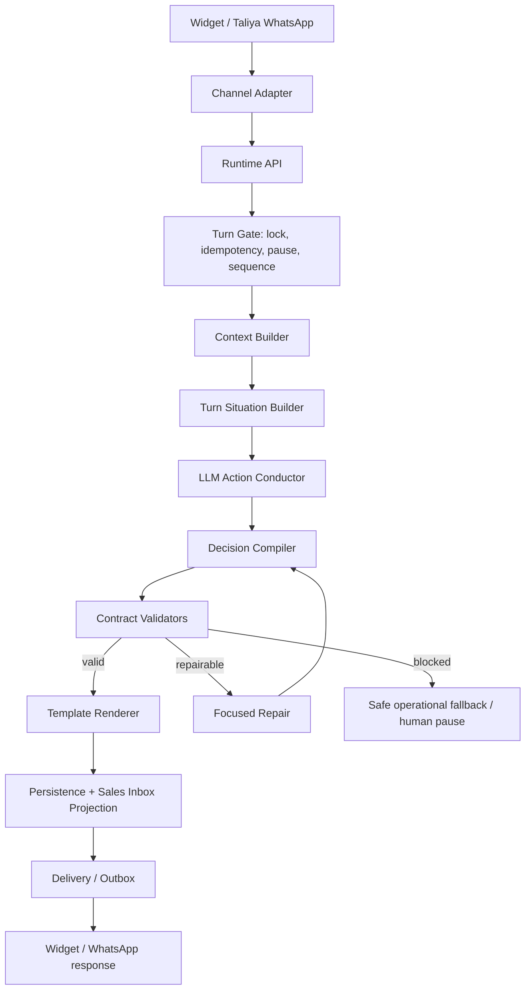

# Architecture - Taliya Commercial Agent Core Reset

This document defines the adjusted architecture for Spec 011. It is based on the existing Taliya contracts, the current runtime audit, and the `openai/openai-cs-agents-demo` reference at local commit `bd7bfca`.

## Verdict On Candidate Architecture

The candidate architecture is good, but incomplete as written.

Keep the core idea:

`Channel Adapter -> Runtime API -> Conversation Lock / Idempotency -> Context Builder -> LLM Conductor -> Specialist Policy -> Validators -> Template Renderer -> Persistence -> Delivery`

Originally adjusted to:

`Channel Adapter -> Runtime API -> Turn Gate -> Context Builder -> LLM Conductor -> Contract Validators -> Repair Loop -> Template Renderer -> Persistence/Projection -> Delivery/Outbox`

After T011-105 paid evidence, adjust it further to:

`Channel Adapter -> Runtime API -> Turn Gate -> Context Builder -> Turn Situation Builder -> LLM Action Conductor -> Decision Compiler -> Contract Validators -> Focused Repair -> Template Renderer -> Persistence/Projection -> Delivery/Outbox`

Key changes:

- Rename `Conversation Lock / Idempotency` to `Turn Gate` and include human pause, inbound sequence, deferred inbound handling during active delivery, and outbox ownership.
- Move product knowledge retrieval into Context Builder.
- Treat Spec 006 product contracts and official product knowledge as product truth inputs to Context Builder, not as prompt folklore or hardcoded branch logic.
- Add Turn Situation Builder so persisted state, pending diagnostic question, allowed actions, and required obligations are explicit before the model call.
- Shrink the conductor output from a full state/render plan into an action decision chosen from the allowed-action menu.
- Add Decision Compiler so deterministic state/render derivation happens after the LLM chooses an action, without raw-text commercial interpretation.
- Treat `Specialist Policy` as roles and policy packs consumed by the conductor, not as deterministic runtime routing.
- Keep repair focused on action-level correction or compiler-safe repair instead of accumulating per-template tactical branches.
- Split persistence into state/event persistence and Sales Inbox projection.
- Make Delivery/Outbox responsible for chunk sequencing and duplicate prevention.
- Add observability/eval events as first-class output of every stage.
- Add shadow mode, feature flag, rollback proof, and first-hours emergency watch as required full-cutover architecture, not optional deployment notes.

## High-Level Flow

## Component Responsibilities

### Channel Adapter

Owns transport-only work:

- Widget request normalization.
- Meta WhatsApp webhook verification/parsing.
- Taliya-owned WhatsApp number guard.
- Attachment/media classification.
- Channel-specific delivery formatting constraints.
- Outbound transport calls.

Must not:

- Decide commercial route.
- Infer price/product/demo/diagnostic/waitlist intent.
- Select templates.
- Advance diagnostic state.

### Runtime API

Owns request boundary:

- HMAC verification for runtime calls.
- Request/response envelope.
- Idempotency lookup.
- Health/config checks.
- Calling the core.

Must not contain commercial branches. `main.py` is mostly reusable if it stays an API shell.

### Turn Gate

Owns concurrency and operational safety:

- One active turn per conversation.
- Stable idempotency key per inbound message.
- Human active/pause means persist inbound and send no AI reply.
- Sequence number for inbound messages.
- Outbox reservation for rendered chunks.
- Deferred inbound handling: if a newer inbound arrives before delivery completes, persist it, finish the already-started outbound response, and process the new inbound only as the next clean turn.
- Duplicate-send prevention.

This is where the real bugs around duplicate chunks and "tudo bem" during chunks should be solved. They are delivery/turn-order bugs, not commercial intent shortcuts. The chosen product decision is to finish the response already being delivered and defer the new inbound message, rather than cancel the current response or start a parallel one.

### Context Builder

Owns typed prompt input:

- Latest inbound message.
- Channel/source metadata.
- Compact conversation memory.
- Last selected templates and outbound text.
- Diagnostic ledger.
- Waitlist/demo/handoff status.
- Product knowledge snippets.
- Spec 006 product contract snippets when the turn asks about the CRM product, access/subscription, setup, operational agents, modes, pages, or product capabilities.
- Sales Inbox projection inputs.
- Reliability labels for identity/contact fields.

Rules:

- Retrieval hints are allowed.
- Retrieval hints do not decide route or answer.
- Product contract snippets inform the LLM conductor; they do not create deterministic commercial branches.
- Internal metadata must be separated from customer-visible text.
- The context must mark what is reliable, inferred, unverified, or internal.

### Turn Situation Builder

Owns the operational situation for the turn:

- Current mode: entry, diagnostic, post_diagnostic, product, price, demo, waitlist, handoff, safety, or delivery_deferred.
- Pending diagnostic question, when one exists.
- Completed and missing diagnostic fields.
- Demo, waitlist, handoff, and delivery/outbox status.
- Allowed actions for this turn.
- Required obligations, such as answer a direct product question first or complete a diagnostic after the last pending answer is captured.
- Eligible template groups for the compiler.
- Official fact keys available to the LLM.

Must not:

- Interpret raw customer text as price, demo, objection, pain, diagnostic acceptance, waitlist, handoff, source/social opening, or product intent.
- Capture diagnostic slots from keyword or regex logic.
- Select customer-facing templates from raw customer text.
- Produce customer-facing prose.

This component is deterministic, but it is not a conversation brain. It only constrains the LLM with the current board state.

### LLM Action Conductor

Owns normal commercial interpretation.

The conductor receives `TurnContext`, `TurnSituation`, relevant policy, and official facts. It returns strict JSON with a small action decision:

- `selected_action`, chosen only from `TurnSituation.allowed_actions`.
- `interpreted_intents`.
- `direct_question` and direct answer obligations.
- `captured_slots`, with evidence.
- `numeric_interpretations`: separates student count, price, date/time, phone/contact, and unknown numeric answer.
- `diagnostic_intent`, `product_fact_keys_used`, `demo_intent`, `waitlist_intent`, and `handoff_intent`.
- `reply_goal`.
- `schema_version`.
- `confidence` and `repair_hints`.

The conductor may internally reason as logical specialists, but normal turns should be one model call. Separate specialist calls are reserved for repair, low-confidence complex diagnostic, or eval.

The conductor must not assemble the full final render plan or final state transition on normal turns. It decides the commercial meaning and action; the compiler turns that into a valid state/render shape.

### Decision Compiler

Owns deterministic compilation after the LLM has chosen an action:

- Derive state transitions from `TurnSituation` and `selected_action`.
- Merge diagnostic ledger updates and complete the diagnostic when all mandatory slots are filled.
- Expand an eligible template group into a concrete template plan.
- Fill official product/runtime variables when they are source-backed.
- Require LLM-provided evidence for customer-specific semantic variables.
- Preserve post-diagnostic state across product, demo, price objection, waitlist, and handoff follow-ups.

Must not:

- Override the LLM's selected commercial action.
- Map raw text keywords to commercial actions.
- Invent semantic customer-facing prose.
- Select a template group that is not allowed for the selected action.

Template variables are not a loophole for free-form assistant text. Any variable that can appear customer-facing must have a registered type, allowed shape, maximum length/structure, grounding source, and validator. Variables may contain short natural-language fragments such as a diagnostic pain reading only when the schema explicitly allows that fragment and the validator can trace it to evidence.

### Contract Validators

Own deterministic contract enforcement:

- Schema and enum validity.
- Allowed state transitions.
- Direct question answered before steering.
- Product facts from official source.
- Price versus student-count disambiguation.
- Diagnostic ledger completeness and no skipped urgency.
- No repeated question unless clarification is justified.
- Waitlist/demo gating.
- Channel constraints.
- Banned phrases and internal text leaks.
- Template ids allowed for state/channel.
- Required variables present and grounded.
- No generic whole-message variables such as `message_text`, `freeform_response`, or `assistant_reply`.
- Direct-question and policy booleans corroborated against evidence and rendered output, not trusted on their own.
- Sales Inbox projection completeness.
- Projection/adapters cannot feed inferred facts back as reliable facts without source/confidence labels.

Validators may:

- Pass.
- Fail with repairable errors.
- Fail with blocked/safety errors.

Validators must not:

- Choose a different commercial route.
- Inject customer-facing commercial copy.
- Fill missing semantic variables with invented content.

### Repair Loop

Owns constrained correction:

- Sends original context, turn situation, original action decision or compiled decision, and validation errors to the model.
- Allows one repair call by default.
- Requires the repaired decision to pass the same validators.
- On repeated failure, returns safe operational fallback/human pause.

Repair is a model path, not an if/regex branch. Structural repair may normalize schema aliases and source-backed compiler output, but it must not become an expanding library of raw-text commercial decision shortcuts.

### Template Renderer

Owns final language assembly:

- Receives a validated template plan.
- Substitutes required variables.
- Applies channel chunking.
- Applies formatting/link rules.
- Emits rendered outbound messages plus rendering metadata.

Must not:

- Select commercial route.
- Decide which diagnostic question comes next.
- Infer product answer.
- Use semantic defaults like "a rotina prioritaria" when evidence is missing.
- Render unregistered free-form prose variables.

### Persistence And Projection

Owns durable state:

- Inbound message event.
- Typed context snapshot.
- Conductor decision JSON.
- Validator report.
- Repair attempts.
- Rendered outbound messages.
- Model usage and cost.
- Runtime state.
- Diagnostic ledger/final diagnostic.
- Waitlist/demo/handoff state.
- Tool/side-effect results.
- Sales Inbox projection.

Sales Inbox is a projection. It can summarize and display, but it cannot become a second source of conversational truth.

### Delivery / Outbox

Owns sending:

- Outbox rows for each rendered chunk.
- Chunk order and pacing.
- WhatsApp no-button constraints.
- Widget action mapping.
- Deferred inbound/no-parallel-response handling.
- Delivery receipt/status updates.
- Duplicate prevention.

Delivery must operate from a committed render plan, not from live ad hoc decisions.

### Trace Store

Owns the complete per-turn audit record:

- Input and channel metadata.
- Context Builder snapshot.
- Conductor request metadata and structured JSON.
- Validator report and repair attempts.
- Selected templates and rendered messages.
- Model usage and cost.
- Runtime state diff.
- Delivery/outbox events.
- Sales Inbox projection.

Trace is not optional observability. It is a correctness artifact and a release gate. A normal commercial turn without trace cannot PASS.

### Static Audit / CI Gate

Owns automated anti-regression checks before code can merge:

- Detect commercial regex/if/token routing outside allowed operational/safety/cold-greeting modules.
- Detect old TS v2 public fallback usage.
- Detect `runner.py` or equivalent files gaining new commercial route/answer logic.
- Detect product facts hardcoded in prompts, templates, tests, or fallback copy where official product knowledge or Spec 006 should be used.
- Detect generic free-form template variables and semantic renderer defaults.
- Detect modules that combine commercial interpretation and customer-facing rendering.

This gate is required because human review alone already failed to prevent deterministic shortcuts.

### Shadow Mode And Cutover

The new core must support shadow execution before public activation:

- Receive the same inbound/context as the active path.
- Produce conductor decision, validators, render plan, trace, and Sales Inbox projection.
- Not send messages to the lead.
- Compare decision/projection/trace quality against golden transcripts and manual review samples.

Production cutover must be controlled by feature flag but is intentionally a 100% cutover, not a staged canary, because the current production behavior is considered worse than the reset risk. Rollback must be tested and must not silently reactivate the old deterministic commercial brain as the active public responder. The first production hours must be treated as an emergency watch with explicit abort criteria.

## Mapping From OpenAI Demo To Taliya

| OpenAI demo element | What it teaches | Taliya adaptation |
| --- | --- | --- |
| `airline/agents.py` | Roles, tools, handoffs, guardrails declared outside server loop | Use a conductor policy pack and logical roles; avoid giant runtime branches |
| Triage + specialist agents | LLM routes to capabilities | One conductor chooses logical specialist role for normal turns |
| `tools.py` | Side effects are explicit tools | Persist diagnostic, waitlist, handoff, Sales Inbox, and delivery as explicit side effects after validation |
| `context.py` | Context is typed and filtered | Build typed `TurnContext`; hide internal fields from rendering |
| `guardrails.py` | Guardrails are visible and model/deterministic separated | Use input safety guardrails plus output contract validators |
| `server.py` Runner loop | Runner owns orchestration; server records events | New core owns orchestration; Runtime API records stage events |
| Runner panel events | Handoff/tool/context updates are inspectable | Persist conductor/validator/repair/render/projection/delivery events for evals and Sales Inbox debugging |

## Current Code Disposition

Keep or adapt:

- `services/taliya-agent-runtime/app/main.py` as API shell.
- `services/taliya-agent-runtime/app/runtime/schemas.py` as seed for stricter schemas.
- `services/taliya-agent-runtime/app/shared/product_knowledge/source.py` as official facts.
- `services/taliya-agent-runtime/app/domains/taliya_commercial/templates.py` as approved language inventory.
- `services/taliya-agent-runtime/app/domains/taliya_commercial/renderer.py` after removing semantic defaults.
- `services/taliya-agent-runtime/app/shared/guardrails/validators.py` as seed for stronger validators.
- `services/taliya-agent-runtime/app/shared/memory/postgres.py` and Sales Inbox storage/projection with consistency fixes.
- `lib/landing/ai-attendant/runtime-client.ts`, `whatsapp.ts`, and `floating-agent.ts` as adapters, after ensuring no commercial interpretation leaks into them.

Quarantine or replace:

- `runtime/runner.py` as the conversation brain.
- Product/price/plan/demo/diagnostic/waitlist/social regex helpers.
- Commercial fast paths.
- Old `agent-v2-*` TypeScript conversational engine for public paths.

Decision: create the new core beside `runtime/runner.py`; do not refactor `runner.py` into the new core. The legacy runner can remain as historical reference, fixture source, or controlled rollback reference, but it must be quarantined from active public commercial decision-making once the new core is enabled.

## Proposed Future Module Layout

This is a target structure for implementation, not code created by this spec:

- `app/core/taliya_commercial/turn_gate.py`
- `app/core/taliya_commercial/context_builder.py`
- `app/core/taliya_commercial/turn_situation.py`
- `app/core/taliya_commercial/conductor_schema.py`
- `app/core/taliya_commercial/conductor.py`
- `app/core/taliya_commercial/decision_compiler.py`
- `app/core/taliya_commercial/policy_pack.py`
- `app/core/taliya_commercial/validators.py`
- `app/core/taliya_commercial/repair.py`
- `app/core/taliya_commercial/rendering.py`
- `app/core/taliya_commercial/projection.py`
- `app/core/taliya_commercial/outbox.py`
- `app/core/taliya_commercial/observability.py`

Ownership rule: each module owns one pipeline responsibility. If a helper interprets commercial meaning, it cannot render customer text. If a helper renders text, it cannot decide commercial meaning.

Schema rule: conductor decision output is versioned. Any change to fields, enums, or structure requires compatibility review, fixture updates, and eval coverage.

## Anti-Monster Rules

- No single file may become the general commercial brain.
- No function may both interpret user intent and produce customer-facing commercial text.
- No template variable may become a hidden full-response channel.
- No deterministic helper may answer or route price, plan, demo, product follow-up, diagnostic, waitlist, pain-first, social/source opening, or mixed-intent turns.
- New behavior requires an explicit contract home, schema field if needed, validator/eval coverage, and regression case.
- Every commercial output must trace back to conductor decision JSON and official product/template sources.
- Repair is explicit and logged; silent post-processing rewrites are forbidden.
- Renderer missing variables fail validation instead of inventing generic copy.
- Sales Inbox completeness is part of the core pass/fail gate.
- Adapter or Sales Inbox inference can support projection, but cannot quietly become reliable memory for the next LLM turn.
- No bug fix may skip the path: regression case, red failure against current system, contract/schema/context/prompt/validator/eval update, implementation, green verification.
- No release may skip shadow mode, tested rollback, and first-hours emergency watch.

## Why Not Full Multi-Agent By Default

Full multi-agent SDK handoffs are attractive because they mirror the reference, but they are not the best default for Taliya now:

- Taliya commercial turns are short, frequent, and cost-sensitive.
- The main quality problem is responsibility drift, not lack of specialist calls.
- A single structured conductor can reason across mixed intents better than a deterministic triage plus fragmented specialists.
- The approved voice and diagnostic ledger require continuity.
- The current contracts already say normal turns should use one model operation.

Use multiple model calls only when they buy correctness: repair, low-confidence diagnostic completion, contradictory context resolution, or eval judging.
